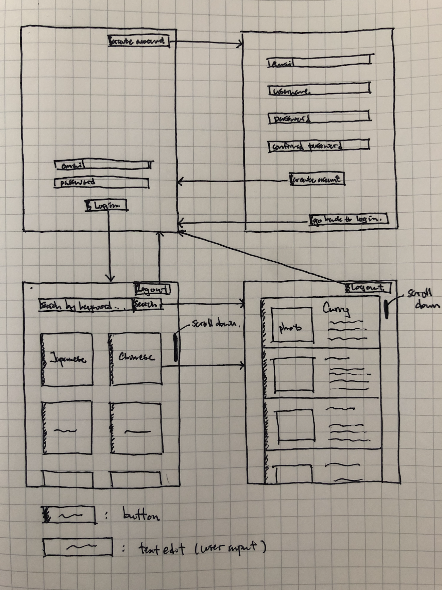
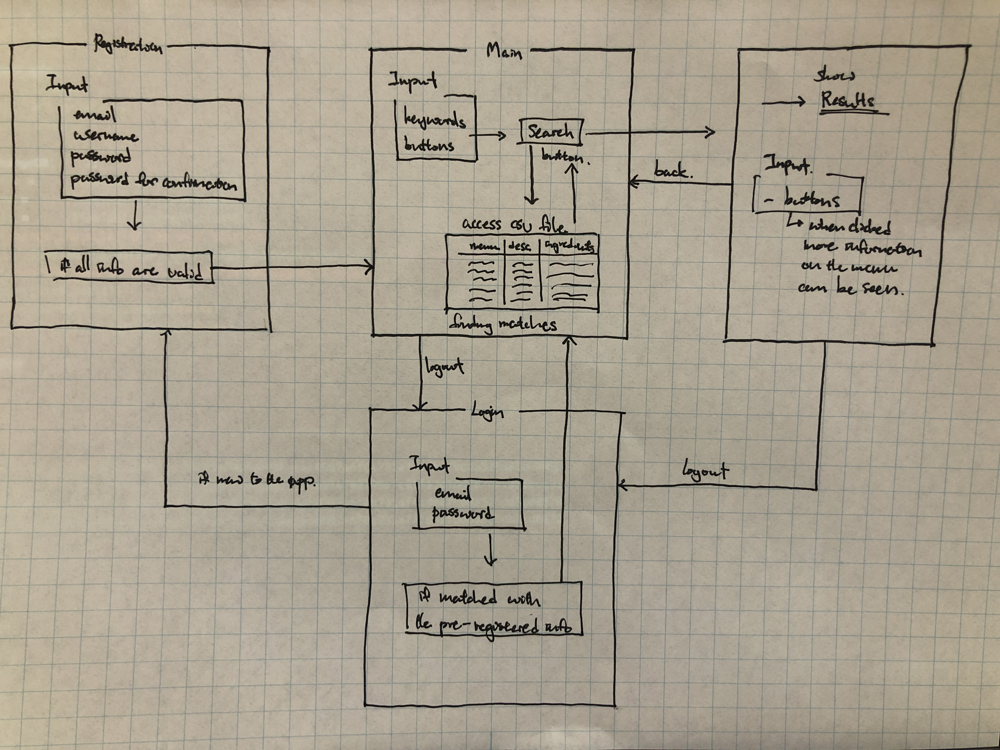
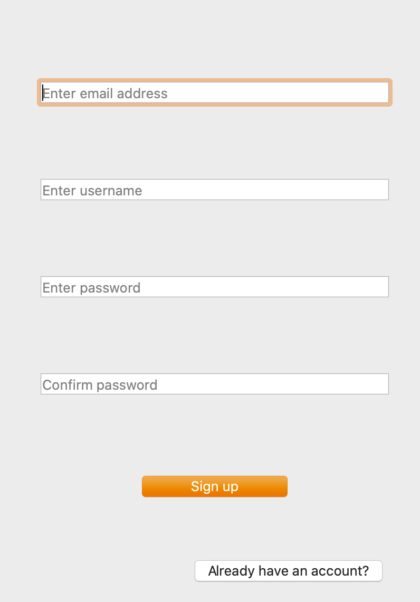

# Software Development 

Repo for the IA

1. [Planning](#Planning)
2. [Design](#Design)
3. [Development](#Development)
4. [Evaluation](#Evaluation)

# Planning 

### Defining the Problem 
My client is my mother, and she is currently facing a problem of having to think of what to cook for every meal; breakfast, lunch and dinner, for her family everyday. Especially in the current situation of covid-19 pandemic, everyone in her family members now stay in their house for the whole day, therefore she needs to cook three meals every day, for the whole family member. My client is in need for something that can help her with coming up with different menus for every meal. She doesn't want to cook the same thing everyday, although she is having trouble coming up with non-repetitive menus. Furthermore, she also wants her family to eat healthily, with balanced nutrition, and she needs a way to find out this information quickly and easily as she is not a big fan of conducting research on the internet. To sum up, my client is in need of a simple way to come up with different but healthy menus for every meal, every day, without having to experience any stress.

### Solution Proposed
The solution for this is to create a mobile application that fulfills her needs. The software should allow my client to live a stress free life, by providing a simple enough way to search for varieties of recipes, along with the ingredients and nutrition data. The input that it will take are the keywords users typed in. The users will also have the option to select the genre of the menu, in case if they cannot come up with any keywords. The application should then output the menus corresponding to the keyword to suggest the possible menus. More specifically it should show the rmenu names, images, description, ingredients, recipe and the nutrition facts so that the user can see all the necessary information in one glance. Furthermore it should also be able to prevent the users from cooking the same meal, therefore it has to acquire a system where, if the user chooses the same menu consecutively, it should notify them that they are doing so. My client only uses her iphone, therefore the shape will of the software will be delivered as a mobile application. Furthermore python will be used as the programming language because it has simple syntax compared to other programming languages. This also makes it easier to debug, and this is worth considering because the program cannot be done in several lines. 

### Success Criteria 

1. User can create their own account
2. User can login to their own account 
3. Keywords can be inputted into the text box in the main page
4. The main page also shows different buttons with the names of different food genre ("Japanese", "Korean", etc.)
5. The search results shows the name of the recipe along an image and a brief description
6. The search results should show multiple menus 
7. When clicking on the recipe from the search results, information about ingredients and nutrition is presented 
8. User can go back and forth a page
9. The user can logout 
10. When same menu has been selected from the search results within 24 hours a message should popup in the center of the page saying "This menu has been selected recently. Do you still want to keep going?"
11. Along with the message in no.9 it should also show a clickable yes or no option below - if yes is selected it should move on to the description page, if no is selected it should stay on the results page


# Design 

### Skecth of the app


This is the sketch of the app. It has the login page, registration page, home page (including search box, buttons), results page, and a description page. These are the main pages that consists the app. All the arrows the image indicate which button redirects the user to which page. For example the "create account" button on the login page, would redirect the user to the sign up (registration) page. In the registration page, the user will have to type in their email address, username, and password twice, just to make sure that the user has no mistake in their information. In the login page, it requires email address, and password. If they type in the valid information for both, they will have access to the search page. In the search page, there are two types of user inputs the app can take: keywords or buttons. In the search box, the user can type in keywords, and the app should show the results of the menus that is related to the keyword. Also another way of looking for the desired menu is by tapping or pressing on the button which says "Japanese", "Chinese", etc. If the user wants to cook a Japanese menu, they can go to the "Japanese" button, and see what menus there are. On the results page it will show a list of all the menus that corresponds to what the user is looking for. The name, photo, and a brief description of the menu, should be presented so that the user has a better idea of what the menu is. Finally in the description page, it should show all the nutrition information, and the recipe of the menu. The recipe should be very easy to follow, even for people who don't know how to cook. It should include everything: how much of what ingredients they need, the procedures to cook them, and the nutrition facts. This sketch is just a general indicator of what this mobile application is going to look like.

### System Diagram of the software 

This is the system diagram of this software. There are basically four main pages as mentioned above. The default of this software is the login page, since every user needs to have a secure account. Registration page is only for users new to the software and haven't created an account before. Then there is the main page, which takes user inputs in two different ways. First is text style. As you can see in the app sketch above, the main page has a searchbox, where the users can type in keywords, and the app will return whatever menu that associates with that keyword. Another input is the buttons. If the users tap or click on these buttons, the app will again, automatically show associated menus with the label of the buttons. The results page is opened, when search button is pressed, and the data has been gathered. It should show the users multiple menus of what they might be looking for. Furthermore users should be able to see more descriptions about the menu once they click the buttons on the results page. This is the basic flow of the entire system.

### Flow charts of the software


# Development 

## Secure Login System 

 In this app, the users will need to be able to log into there own page. One of the function of this app is that it should remember what the user searched before. Therefore there needs to be a page that is dedicated only to the user themselves. This is why the app needs a secure login system; to make sure that other users don't mess with other people's accounts.
 One of the requirements for the secure login system is that it is very clear for the user. There are few boxes for the users to type in their personal information, and these boxes should indicate very clearly which information should be entered where. For example this is what the sign up window looks like:



In this program what is different is that I actually divided the functions back into small bits. What I wanted to do was that I wanted to check if all the functions return True or not, and if does then it should open the main page. This is why I seperated all the functions so that it can either return true or nothing for each one. This enabled me to say that if all the test passes, then it can open the main page. This code works completely fine, although I thought that it was hard to read. I tried to repeat the same thing again and again, for example the line `variableName = self.lineEdit_n.text()`. I couldn't figure out how to create a variable in a class that can be used in method within the class, and I did manage to do this by setting a parameter in each function, that has the same name as the variable. Although, this made things rather complicated, and the code is now very hard to read, and unorganized. Thus I decided to reorganize the code again, with the same function but easier to understand and check. Also I added a new method called storeSecureInfo and this allows the user information to be encrypted and stored. The mechanism will be explained below. This is the new and final code:
```py
    def openlogin(self):
        login = loginWindow(self)
        login.show()

    def checkUsername(self):
        username = self.username.text()
        if username.isalpha() or username != "":
            self.username.setStyleSheet("border: 2px solid blue")
            return True
        self.username.setStyleSheet("border: 2px solid red")
        return False

    def checkEmail(self):
        email = self.email.text()
        if "@" not in email or email.isdigit() or email == "":
            self.email.setStyleSheet("border: 2px solid red")
            return False
        self.email.setStyleSheet("border: 2px solid blue")
        return True

    def checkPassword(self):
        password = self.password1.text()
        if password.isalpha() or password.isdigit() or len(password)<6 or password == "":
            self.password1.setStyleSheet("border: 2px solid red")
            return False
        self.password1.setStyleSheet("border: 2px solid blue")
        return True

    def checkConfirmedPassword(self):
        password = self.password1.text()
        confirmedPassword = self.password2.text()
        if password == confirmedPassword and password != "" and confirmedPassword != "":
            self.password1.setStyleSheet("border: 2px solid blue")
            self.password2.setStyleSheet("border: 2px solid blue")
            return True
        self.password1.setStyleSheet("border: 2px solid red")
        self.password2.setStyleSheet("border: 2px solid red")
        return False

    def checkRegistration(self):
        self.checkUsername()
        self.checkEmail()
        self.checkPassword()
        self.checkConfirmedPassword()
        if self.checkUsername() is True and self.checkEmail() is True:
            if self.checkPassword() is True:
                if self.checkConfirmedPassword() is True:
                    self.openMain()
                    self.storeSecureInfo()

    def openMain(self):
        main = mainWindow(self)
        main.show()

    def storeSecureInfo(self):
        email = self.email.text()
        password = self.password1.text()
        hashedInfo = myLib.hashPassword(username + password)
        with open('output.txt','a') as outputFile:
            outputFile.write(f"{hashedInfo}\n")
        self.close()
```
First of all what I did in this code is that, I changed the names of the methods, because in the previous code, I focused too much on how to shorten the method names, that it became hard to understand which method does what. Therefore in this new code, I changed the name to something that is a little bit longer, but more explicit. In this way we can tell what method does what immediately. Second, I replaced the variables of the texts. I decided to repeat the variable each time in different methods, because I thought that this is the most simple way, and it is easy to understand. Also for the step that checks if all the methods retur true or not, I put that into a whole new method called checkRegistration whereas initially I had it in the openMain method. This too, is for th reason of making it as simple as possible. I wanted the openMain method to only be dedicated on that one move and nothing else, because it makes things much more easier. Finally for the new method, it's functionality is that, it takes the username as well as the password and it encrypts them and store it in a txt file called output.txt. This becomes very important when the user wants to log into their own account, because the username and the password will be securely stored in the program. In the method it says `hashedInfo = myLib.hashPassword(username + password)`, and this function hashPassword does the encrypting part. This explanation is in the section "Secure Login System".


### Login in 

In the login page, what the user needs to be able to do is to type in their username and password, and if they entered the correct information, then they should be able to go inside the main page. The username and the password should come from the information they entered in the sign up page. Only if the typed in information in the login page, matches with the information that the user typed in for registration previously, then they should be able to access their inventory. 
```py
class loginWindow(login):
    def __init__(self, parent=None):
        super(loginWindow, self).__init__(parent)
        self.setupUi(self)
        self.username.setPlaceholderText("enter username")
        self.password.setPlaceholderText("enter password")

        # pushButton = signupButton
        self.pushButton.clicked.connect(self.opensignup)
        # password -> black dot
        # self.password.setEchoMode(QLineEdit.Password)
        self.loginButt.clicked.connect(self.checkLoginInfo)

    def openMain(self):
        main = mainWindow(self)
        main.show()

    def opensignup(self):
        signup = signupWindow(self)
        signup.show()

    def checkLoginInfo(self):
        email = self.email.text()
        password = self.password.text()
        outputFile = open('output.txt', 'r')
        count = 0
        for line in outputFile:
            count += 1
            if myLib.verifyPassword(line, email + password) is True:
                self.email.setStyleSheet('border: 2px solid blue')
                self.password.setStyleSheet('border: 2px solid blue')
                # self.close()
                self.openMain()
                break
            else:
                self.email.setStyleSheet('border: 2px solid red')
                self.password.setStyleSheet('border: 2px solid red')
```
This is the full code for the login page. In this class there are three methods. There is the openMain and openSignup method, which simply opens the main page and the signup page. The third method is called the checkLoginInfo, and this method is the most important one. In this method, it takes the username and password typed in by the user, and basically what it does is that it compares the encrypted version of those two values with the stored value in output.txt. This stored value is the encrypted username and password that was typed in the sign up page. This is where the storeSecureInfo in the signUpWindow class and this method link together. When receiving the stored value from output.txt, it is programmed so that it reads one line each, so that multiple users can use the app. The received information is now compared to the new hashed information. These processes are all done in the verifyPassword function located in myLib, and there will be a brief explanation about this later on. If this function returns true, meaning if the two values, the stored and the provided information, are matching then it opens the main page, and simultaneously close the login page. Otherwise, it would indicate an error by changing the color of thw text box.


### Secure Login System 
This secure login system is to increase the security for the user so that their personal data will not be stolen or seen without permission. There are two main functions that shape up this system:
```py
import hashlib, binascii, os

def hashPassword(password):
    salt = hashlib.sha256(os.urandom(60)).hexdigest().encode('ascii')
    pwdhash = hashlib.pbkdf2_hmac('sha512', password.encode('utf-8'), salt, 100000)
    pwdhash = binascii.hexlify(pwdhash)
    return (salt + pwdhash).decode('ascii')

def verifyPassword(storedPassword, providedPassword):
    salt = storedPassword[:64]
    storedPassword = storedPassword[64:-1]
    print(storedPassword)
    pwdhash = hashlib.pbkdf2_hmac('sha512', providedPassword.encode('utf-8'), salt.encode('ascii'), 100000)
    pwdhash = binascii.hexlify(pwdhash).decode('ascii')
    print(pwdhash)
    return pwdhash == storedPassword
```
In the hashPassword function, first of all it creates something called the salt. In the line `salt = hashlib.sha256(os.urandom(60)).hexdigest().encode('ascii')`, the default size of a hash is 64 bytes, and they are converted into worth 64 bytes of ascii characters. Basically salt is a set of information that randomly generated, just to make the password harder to decode. Then in `hashlib.pbkdf2_hmac('sha512', password.encode('utf-8'), salt, 100000)`, it hashes the encoded password using the salt that has been generated, and that information is made to 64 bytes, and that process will be repeated 100000 times, so that it would become more random. Then after that it is encoded 2 bytes hexadecimal string. Thus the return value is the value of the hashed password but with the salt in front of it. This function was called in the signupWindow class' storeSecureInfo method. In this case the parameter was the password that the user typed in to the password text box. And this new value generated through the hashPassword function is stored into a text file so that it can be retrieved and compared in the later process. 

In the verifyPassword function, it almost does the same thing. The password provided by the user in the login page, is taken as the parameter providedPassword, and this is hashed using the exact same process in the previous function. What is different in this function is that this function is to compare the two values: the stored value that was created with the hashPassword, and the hashed provided password. What it does to compare these two values, is first it retrieves the stored password (the function itself doesn't but in the checkLoginInfo method it does), and it checks for the salt. The salt is the first 64 digits, so it neglects all of that and takes the rest of the value which is supposedly the hashed password. If this matches the newly hashed password, then the user will be able to go in their page. This function returns a boolean, and if it is true, then it will go to the main page.
 
 

## Creating a database

The most crucial part of this software is the searching function. One of the main purpose of this software is for the user to search random menus, to give them ideas of what they can make for their meals. To restate the requirement, when the users types in keywords, they should be able to access menus corresponding to those keywords. In order to create such search engine, first we need data. The data in this case would be the necessary information about the menus.
The method of this "search" procedure should be something like this:

1. When search button is pressed, it reads the keyword the user typed in
2. At the same time, access the csv file with prestored data 
3. Look for matches in menu names, and ingredients
4. Show the results 
5. If no match show "no match" on screen 

### Creating a csv file 

 Creating new informations about the menus are very time consuming, since in this case, we need to have many range of menus, so that the user has something to choose upon. Therfore instead of creating a new database by myself, I decided to get data from different websites. In this way it is more time efficient, and I will able to load many different menus very quickly. For this, I used a method called Webscraping. Webscraping is basically the skill of skimming through different websites and getting the only informations you desire. To do this we use the html of the website, and indicate which tags we want to extract from the website. This is the basic for accessing a website in python:
```py
import requests

allRecipes = requests.get("https://www.allrecipes.com/recipes/1947/everyday-cooking/quick-and-easy/?page=" + str(page))
```
 This code is essentially requesting access to the website. If we print this result it would give codes such as `Request[403]` or `Request[200]`. 403 is an HTML status code, which basically means "forbidden". If it returns 403, this means that the website has denied access, because of some reason. On the other hand, 200 is another HTML status code, which means "Request successful". The code aboce sucessfully returns 200, which means that access permission was granted. If this is okay, then the next step is extracting the desired information using html tags. By importing a package called the BeautifulSoup into the python file, I was able to retrieve the html code of the website with the following code:
```py
allRecipes_soup = BeautifulSoup(allRecipes.content, "html.parser")
containers1 = allRecipes_soup.findAll("article", {"class": "fixed-recipe-card"})
```
 With the first line it gets entire html code of the website, and by using the "findAll" command that is inside the BeautifulSoup package, it goes throug entire html code and tries to find the desginated tag. Here I wanted to retrieve all the menu names on the website. To get the html tag of the menu names, I inspected the website by pressing "inspect", which appears when right clicking on the homepage. From there I tracked down the html tag of the menu names, and since all of the menu names had the same tag and class name: `"fixed-recipe-card"`, I simply executed the findAll command to retrieve all of the menu names on the webpage. Then I did the same thing for the descriptions of the menus. Description of the menu would be necessary for the users, since the name of the menu is not sufficient enough to show what kind of menu the user is about to make. 
 
 Another thing I had to add were the ingredients for all the menus. Although, since all the ingredients were written inside another link, which is the link for the individual menus, I decided to retrieve all of the hrefs of the desginated tag. I will be explaining this more later on the repo. 
 
Because the findAll command can hekp us find all of the referring tags, the code itself was very simple. Although because in this app, I wanted to have many menus available for the users, I chose not only to inspect the first page of the website but for multiple pages. Each page in the www.allrecipes.com contained twenty different menus, thus I ran a for loop for multiple pages, to retrieve as many manu informations as possible. The following is the code:

```py
filename1 = "recipes.csv"
f1 = open(filename1, "w")

headers1 = "menu_name, menu_description, recipe_link \n"
f1.write(headers1)

# retrieve data from www.allrecipes.com (source 1)
pageNum = 2
# # list for all the names, descriptions and links
name_list = []
desc_list = []
link_list = []
for page in range(pageNum, n):
    # retrieving html code
    allRecipes = requests.get("https://www.allrecipes.com/recipes/1947/everyday-cooking/quick-and-easy/?page=" + str(page))
    allRecipes_soup = BeautifulSoup(allRecipes.content, "html.parser")
    # assigning which html tag to look for
    containers1 = allRecipes_soup.findAll("article", {"class": "fixed-recipe-card"})
    # for all the containers in the same page repeat the process
    for container in containers1:
        # retrieve the menu names
        name_container = container.find("span", {"class":"fixed-recipe-card__title-link"})
        menu_name = name_container.text
        name_list.append(menu_name)
        # retrieve descriptions
        desc_container = container.find("div", {"class":"fixed-recipe-card__description"})
        menu_desc = desc_container.text
        desc_list.append(desc_list)
        # retrieve links for the recipe
        link_container = container.find("a", {"class":"fixed-recipe-card__title-link"})
        recipe_link = link_container["href"]
        # adding links into the list
        link_list.append(recipe_link)
        print(f"name: {menu_name} \n description: {menu_desc} \n link: {recipe_link}")
        # adding data into csv file
        f1.write(menu_name.replace(",", " ") + "," + menu_desc.replace(",", "/") + "," + recipe_link + "\n")
```
The range of the for loop `(pageNum, n)`, where n can be any number bigger than 2. If I print the results on the console it would be something like this: 
```
name: A Good Easy Garlic Chicken 
 description: Sprinkle chicken breasts with garlic powder, onion powder and seasoning salt - then sautee and enjoy. Couldn't be easier! Great recipe for quick and easy meal, even for the pickiest eater! 
 link: https://www.allrecipes.com/recipe/23998/a-good-easy-garlic-chicken/
name: Balsamic-Glazed Salmon Fillets 
 description: A glaze featuring balsamic vinegar, garlic, honey, white wine and Dijon mustard makes baked salmon fillets extraordinary. 
 link: https://www.allrecipes.com/recipe/82817/balsamic-glazed-salmon-fillets/
name: Quick Chicken Piccata 
 description: Chef John's quick and easy pan-fried chicken breasts are topped with a simple pan sauce made with capers, butter, white wine, and lemon juice. 
 link: https://www.allrecipes.com/recipe/220751/quick-chicken-piccata/
name: Baked Salmon Fillets Dijon 
 description: Delicious baked salmon coated with Dijon-style mustard and seasoned bread crumbs, and topped with butter. 
 link: https://www.allrecipes.com/recipe/22538/baked-salmon-fillets-dijon/
```
This is just part of the output. Although essentially this would continue until the for loop has looped over every page. Then after all of this is done, these extracted data needs to be stored inside a csv file, so that it can access this information anytime when the software is activated. The relevant codes for this process is the following part:
```py
filename1 = "recipes.csv"
# open file recipes.csv
f1 = open(filename1, "w")
# Create titles of the rows
headers1 = "menu_name, menu_description, recipe_link \n"
f1.write(headers1)

for page in range(pageNum, 3):
    # extracting html code
    for container in containers1:
        # find tags for desired data
        f1.write(menu_name.replace(",", " ") + "," + menu_desc.replace(",", "/") + "," + recipe_link + "\n")
        
f1.close()
```
This is the code snipet of the part where it copies extracted information inside a csv file. All of the information that were extracted from the webpages are now accessible in one page. 

This is the basic procedure of creating a csv file, and in the actual software, I used several different websites, and within those different websites, multiple pages, to diversify the data, and to have many options kept for the users. 

### Accessing and reading data from the csv file


